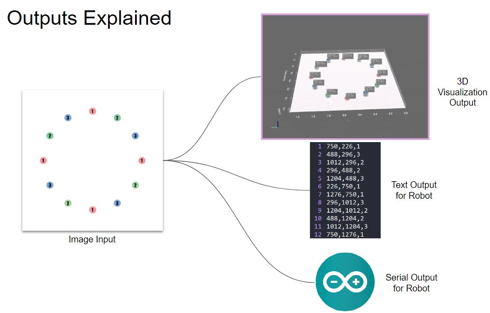
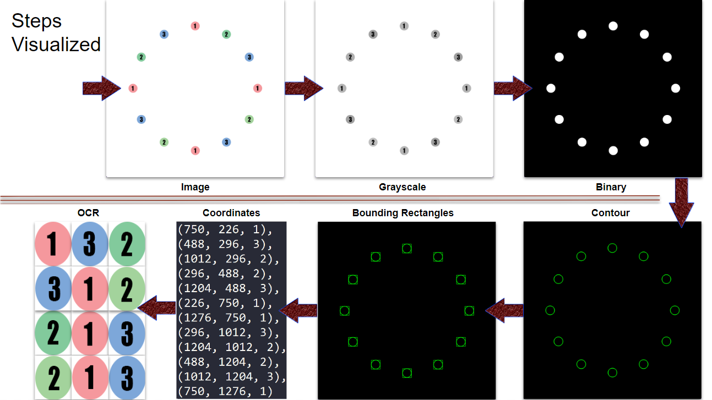
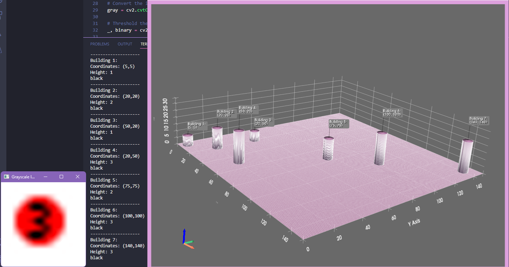
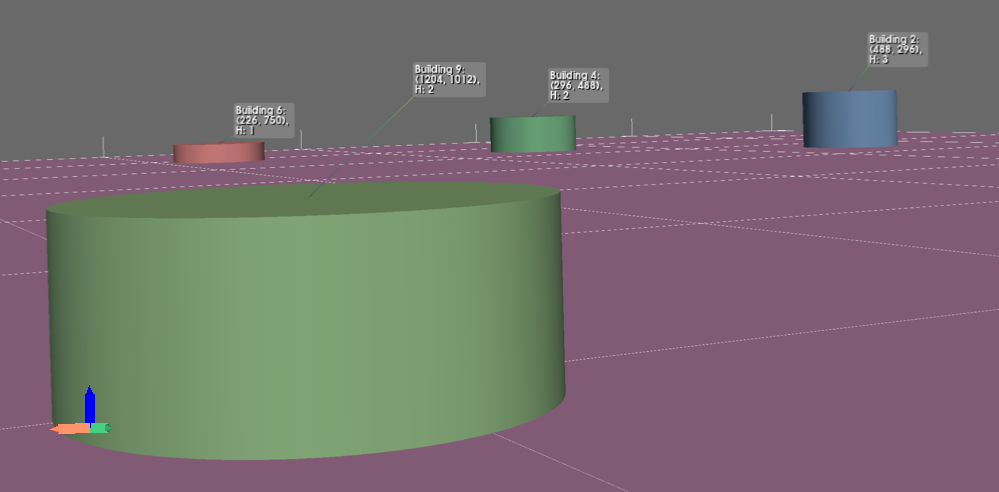

# Constructor Robot with a Given Map of Buildings

This repository includes the software of the CMP sub-system of our graduation capstone project. 
| Sub-team | Student 1 | Student 2 |
|--|--|--|
| Computer Engineering (CMP) | Ugur Taysi | Sevval Colak  |
|Mechatronics Engineering (MCH)|Dogacan Sahin|Zeynep Suzen|

The task of CMP students includes the use of image processing in order to process the given map image of buildings. The program finds coordinate of each building, along with height and color info. Then outputs are generated as 3D visualization and raw results data for the robot's input. This is done using the OpenCV library for processing the map images, and the PyVista library for the 3D visualization of the given maps. The results of the image processing steps are then transferred over to the robot via Arduino serial connection. 
The task of the crane robot built by the MCH sub-team is to input the result data generated by us and autonomously build the small scale city by placing cylinders at correct positions to replicate the initial map image. 

For more details you can check the **"3.1.5 - Implementation"** section on **page 46 of the "Project Report.pdf"** file. 
## How it works




## Demo Preview
GIF Output
###### *(Click on GIF below to play)*


3D Visualization Freeview + Coordinates Text Output


Zoomed View from the Freeview



## Installation
- Install Python
- Install Tesseract (Guide: https://github.com/UB-Mannheim/tesseract/wiki). 

Install required Python libraries with the following pip command: 
```
pip install pyvista opencv-python numpy pytesseract webcolors pyserial
```

## Usage
- You can change the input map image by changing to the desired image name from line 27.
```
image_path  = os.path.join(project_folder, 'maps', 'map0.png')
```
In the ***maps*** folder there are several maps you can choose from. You can also use the included "LargeCircularMapBase.psd" file to create your custom map with Adobe Photoshop. 
- By default, the Arduino serial passthrough is disabled. The outputs are the 3D visualization in either freeview or as GIF output, along with a TXT output with coordinates. If you also want to pass the data to Arduino via serial connection, you can uncomment the section of code between lines 98-112. In this case if an Arduino is not connected to the PC you will get an error. 