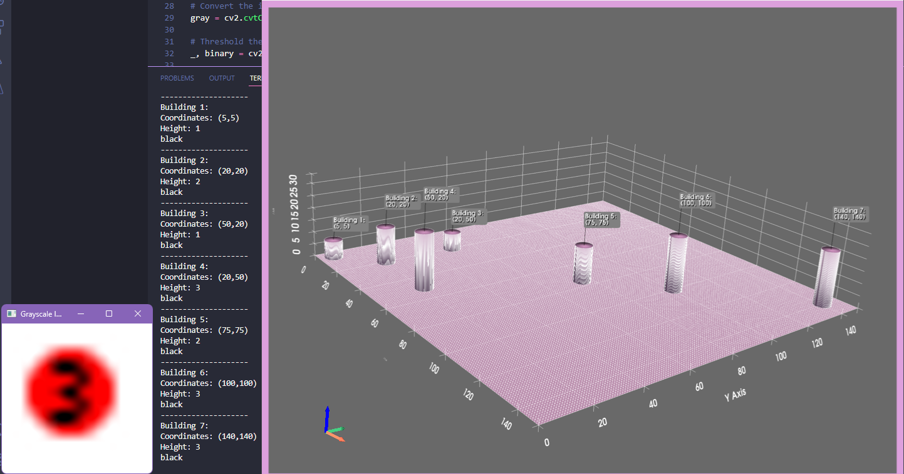

# MapImage2Robot

## System Requirements
- Python
- Tesseract (Manual Download: https://github.com/UB-Mannheim/tesseract/wiki)

## Current Todo: 

- [MISC] Maybe add auto 3d rotation gif/mp4 from test.py (https://docs.pyvista.org/version/stable/api/plotting/_autosummary/pyvista.Plotter.generate_orbital_path.html) (also check next items from Plotter wiki)
- [FIX] Color reading. Currently getting blue/black instead of red. WHY?!
- [FIX] Building order of text output and 3D doesn't currently match. Fix text output building order.
- ~~[DONE-optimize?] Fix 3D Visualization Scaling~~
- ~~[DONE] Make sure all variables are linked to map input variables and not constants on final working version~~
- ~~[DONE-double_check_variations_for_scaling] Switch to 150x150 map with 7x7 buildings~~
- Add exlusion zone in the middle and change input maps accordingly after getting exact zone coords from Zeynep
- ~~[DONE] Add OCR to initial image processing~~

## Unfinished Screenshots 

